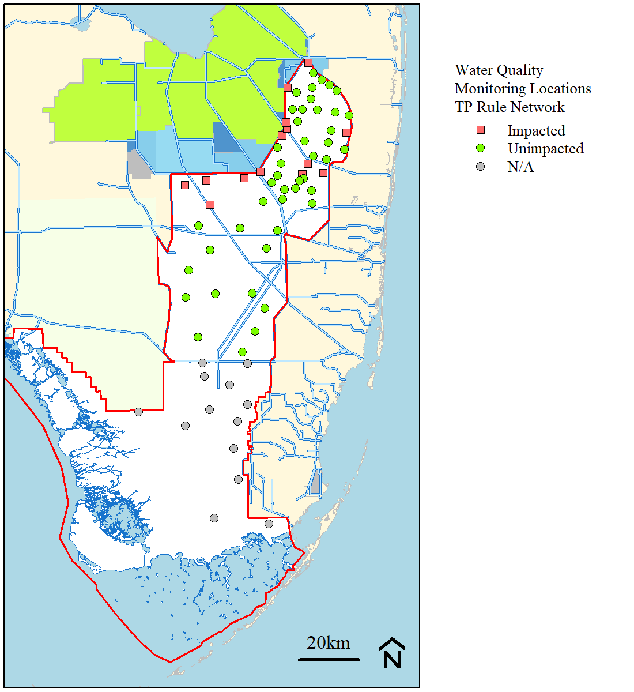

```{r setup, include=FALSE}
knitr::opts_chunk$set(echo = TRUE)
```

```{r,echo=FALSE,warning=FALSE,include=FALSE}
CurWY=2022

## Libraries
# Data Wrangling
library(AnalystHelper);
library(plyr);
library(reshape)

library(zoo)

# Data Vis
library(flextable)
library(magrittr)

# -------------------------------------------------------------------------
station.list=data.frame(Station.ID=c("2AC2", "2AN1", "3ASMESO", "404C2", "404Z1", "CA2-17", "CA2-6", 
                        "CA2-9", "CA217", "CA222", "CA223", "CA224", "CA26", "CA29", 
                        "CA3-11", "CA3-14", "CA3-15", "CA3-16", "CA3-19", "CA3-2", "CA3-4", 
                        "CA3-5", "CA3-6", "CA3-8", "CA3-9", "CA311", "CA314", "CA315", 
                        "CA316", "CA319", "CA32", "CA324", "CA325", "CA33", "CA34", "CA35", 
                        "CA36", "CA38", "CA39", "CA3B1", "CA3B2", "CR2", "E5", "EP", 
                        "F1", "F3", "F4", "F5", "G-3273", "LOX10", "LOX11", "LOX12", 
                        "LOX13", "LOX14", "LOX15", "LOX16", "LOX3", "LOX4", "LOX5", "LOX6", 
                        "LOX7", "LOX8", "LOX9", "LOXA101", "LOXA105", "LOXA108", "LOXA124", 
                        "LOXA130", "LOXA137", "LOXA140", "LOXAZ1", "N-217", "N1", "NE1", 
                        "NP201", "P33", "P34", "P37", "RG1", "S345B6", "SRS1B", "SRS1C", 
                        "SRS2", "TSB", "U1", "U3", "WCA2E5", "WCA2F1", "WCA2F3", "WCA2F4", 
                        "WCA2F5", "WCA2U1", "WCA2U3", "X1", "X4", "Z1"),
           Alias=c("404C2", "2AN1", "3ASMESO", "404C2", "404Z1", "CA217", "CA26", 
                   "CA29", "CA217", "CA222", "CA223", "CA224", "CA26", "CA29", "CA311", 
                   "CA314", "CA315", "CA316", "CA319", "CA32", "CA34", "CA35", "CA36", 
                   "CA38", "CA39", "CA311", "CA314", "CA315", "CA316", "CA319", 
                   "CA32", "CA324", "CA325", "CA33", "CA34", "CA35", "CA36", "CA38", 
                   "CA39", "CA3B1", "CA3B2", "CR2", "E5", "EP", "WCA2F1", "WCA2F3", 
                   "WCA2F4", "WCA2F5", "G-3273", "LOX10", "LOX11", "LOX12", "LOX13", 
                   "LOX14", "LOX15", "LOX16", "LOX3", "LOX4", "LOX5", "LOX6", "LOX7", 
                   "LOX8", "LOX9", "LOXA101", "LOXA105", "LOXA108", "LOXA124", "LOXA130", 
                   "LOXA137", "LOXA140", "Z1", "CA217", "2AN1", "NE1", "NP201", 
                   "P33", "P34", "P37", "RG1", "S345B6", "SRS1B", "SRS1C", "SRS2", 
                   "TSB", "U1", "U3", "E5", "WCA2F1", "WCA2F3", "WCA2F4", "WCA2F5", 
                   "U1", "U3", "X1", "X4", "Z1"),
           Area=c("WCA2", "WCA2", "WCA3", "WCA2", "WCA2", "WCA2", "WCA2", "WCA2", 
                  "WCA2", "WCA2", "WCA2", "WCA2", "WCA2", "WCA2", "WCA3", "WCA3", 
                  "WCA3", "WCA3", "WCA3", "WCA3", "WCA3", "WCA3", "WCA3", "WCA3", 
                  "WCA3", "WCA3", "WCA3", "WCA3", "WCA3", "WCA3", "WCA3", "WCA3", 
                  "WCA3", "WCA3", "WCA3", "WCA3", "WCA3", "WCA3", "WCA3", "WCA3", 
                  "WCA3", "ENP", "WCA2", "ENP", "WCA2", "WCA2", "WCA2", "WCA2", 
                  "ENP", "LNWR", "LNWR", "LNWR", "LNWR", "LNWR", "LNWR", 
                  "LNWR", "LNWR", "LNWR", "LNWR", "LNWR", "LNWR", "LNWR", 
                  "LNWR", "LNWR", "LNWR", "LNWR", "LNWR", "LNWR", "LNWR", 
                  "LNWR", "LNWR", "WCA2", "WCA2", "ENP", "ENP", "ENP", "ENP", 
                  "ENP", "ENP", "WCA3", "ENP", "ENP", "ENP", "ENP", "WCA2", "WCA2", 
                  "WCA2", "WCA2", "WCA2", "WCA2", "WCA2", "WCA2", "WCA2", "LNWR", 
                  "LNWR", "LNWR"))

impact.sites.2005=c(paste0("LOXA",c(101,105,124,130,137,140)),"X1","Z1","2AN1","404Z1",paste0("WCA2",c("F1","F3","F4")),paste0("CA",c(223,224,314,324,33,35,36)))
station.list$status_2005=with(station.list,ifelse(Alias%in%impact.sites.2005,"Impacted","Unimpacted"))

# Water Quality Data ------------------------------------------------------
dates=date.fun(c("2004-05-01",paste0(CurWY,"-04-30")))
parameters=data.frame(Test.Number=c(23,25),param=c("OPO4","TP"))

pb=txtProgressBar(min=1,max=nrow(station.list),style=3)
wq.dat=data.frame()
for(i in 1:nrow(station.list)){
  tmp=DBHYDRO_WQ(dates[1],dates[2],station.list$Station.ID[i],parameters$Test.Number)
  wq.dat=rbind(wq.dat,tmp)
  setTxtProgressBar(pb,i)
}

wq.dat=merge(wq.dat,station.list,"Station.ID")
wq.dat=merge(wq.dat,parameters,"Test.Number")
wq.dat$TPWeek=biweek.period(wq.dat$Date.EST)
wq.dat$WY=WY(wq.dat$Date.EST)

raw.dat=subset(wq.dat,Test.Number==25&WY%in%seq(CurWY-4,CurWY,1))[,c("Alias","Area","Date.EST","WY","TPWeek","Test.Name","Units","HalfMDL")]

P.dat.xtab=cast(wq.dat,Alias+Area+Date.EST+WY+TPWeek~param,value="HalfMDL",mean)
P.dat.xtab$OPFlag=with(P.dat.xtab,ifelse(is.na(OPO4)|OPO4==0,1,0));
P.dat.xtab$TPFlag=with(P.dat.xtab,ifelse(is.na(TP),1,0));
P.dat.xtab$Reversal=with(P.dat.xtab,ifelse(P.dat.xtab$OPFlag==1,0,ifelse(OPO4>(TP*1.3),1,0)));
plot(TP~OPO4,P.dat.xtab,ylab="TP (mg L\u207B\u00b9)",xlab="SRP (mg L\u207B\u00b9)",pch=21,bg=ifelse(Reversal==1,"red",NA),col=adjustcolor("grey",0.8),log="xy");abline(0,1,col="red")

P.dat.xtab$TP=with(P.dat.xtab,ifelse(Reversal==1,NA,TP));# Removes Reversal 
P.dat.xtab$TP_ugL=P.dat.xtab$TP*1000
P.dat.xtab$HydroSeason=FL.Hydroseason(P.dat.xtab$Date.EST)

## Biweekly mean TP data + Data Screening
TPRule.dat=ddply(P.dat.xtab,
                 c("Area","Alias","WY","TPWeek","HydroSeason"),summarise,
                 AMean=mean(TP_ugL),
                 N=N.obs(TP_ugL));
TPRule.dat.screen=ddply(TPRule.dat,c("Alias","WY","HydroSeason"),summarise,N=N.obs(AMean));
TPRule.dat.screen=cast(TPRule.dat.screen,Alias+WY~HydroSeason,value="N",sum);

TPRule.dat.screen$NTotal=with(TPRule.dat.screen,A_Wet+B_Dry);
TPRule.dat.screen$SeasonScreen=with(TPRule.dat.screen,ifelse(B_Dry>=1&A_Wet>=1,1,0))
TPRule.dat.screen$NScreen=with(TPRule.dat.screen,ifelse(NTotal>=6,1,0));
TPRule.dat.screen$UseData=with(TPRule.dat.screen,ifelse((SeasonScreen+NScreen)==2,"Yes","No"));

TPRule.dat=merge(TPRule.dat,TPRule.dat.screen[,c("Alias","WY","UseData")],by=c("Alias","WY"),all.x=T)
range(TPRule.dat$WY)

# Impacted Station Assessment ---------------------------------------------
# Annual Geometric Mean
TPRule.AGM.ImpactAss=ddply(subset(TPRule.dat,Alias%in%impact.sites.2005),c("Area","Alias","WY","UseData"),summarise,
                           N=N.obs(AMean),Geomean=exp(mean(log(AMean),na.rm=T)))
TPRule.AGM.ImpactAss$Geomean.Use=with(TPRule.AGM.ImpactAss,ifelse(UseData=="Yes",Geomean,NA));

TPRule.AGM.ImpactAss$AGMStatus=with(TPRule.AGM.ImpactAss,ifelse(Geomean.Use<=15,"Pass","Fail"))
TPRule.AGM.ImpactAss$Geomean.Use.rnd=round(TPRule.AGM.ImpactAss$Geomean.Use,0)
TPRule.AGM.ImpactAss=TPRule.AGM.ImpactAss[order(TPRule.AGM.ImpactAss$Area,TPRule.AGM.ImpactAss$Alias),]

# Long Term Geometric Mean 
WYs=seq(WY(dates[1]),WY(dates[2]),1)
fill.df=data.frame(Alias=sort(rep(impact.sites.2005,length(WYs))),WY=rep(WYs,length(impact.sites.2005)))
fill.df=merge(fill.df,station.list[,c("Station.ID","Area")],by.x="Alias",by.y="Station.ID",all.x=T)

TPRule.dat.LTScreen=merge(TPRule.AGM.ImpactAss,fill.df,c("Alias","WY","Area"),all.y=T)
TPRule.dat.LTScreen$LTMean=with(TPRule.dat.LTScreen,ave(Geomean.Use,Alias,FUN=function(x)c(rep(NA,4),rollmean(x,5,na.rm=T))))
TPRule.dat.LTScreen$LT.N=with(TPRule.dat.LTScreen,ave(Geomean.Use,Alias,FUN=function(x)c(rep(NA,4),rollsum(is.na(x)==0,5,na.rm=T))))
TPRule.dat.LTScreen$LT.UseData=with(TPRule.dat.LTScreen,ifelse(LT.N<5,"No","Yes"))
TPRule.dat.LTScreen$LTperiod=with(TPRule.dat.LTScreen,ave(WY,Alias,FUN=function(x)c(rep(NA,4),paste0("WY",rollapply(x,5,min),"-",rollapply(x,5,max)))))
TPRule.dat.LTScreen$LTStatus=with(TPRule.dat.LTScreen,ifelse(LT.UseData=="Yes"&round(LTMean)<=10,"Pass","Fail"))
TPRule.dat.LTScreen$LTGM.rnd=with(TPRule.dat.LTScreen,ifelse(LT.UseData=="No",NA,round(LTMean)))

TPRule.dat.LTScreen$Status=with(TPRule.dat.LTScreen,ifelse(is.na(AGMStatus)|is.na(LTStatus),"Impacted",ifelse(AGMStatus=="Pass"&LTStatus=="Pass","Unimpacted","Impacted")))


## TP Rule Evaluation
TPRule.dat.LTScreen[,c("Alias","WY","Status")]
head(TPRule.dat)

TPRule.dat=merge(TPRule.dat,TPRule.dat.LTScreen[,c("Alias","WY","Status")],c("Alias","WY"),all.x=T)
TPRule.dat$Status=with(TPRule.dat,ifelse(is.na(Status)==T,"Unimpacted",as.character(Status)))
TPRule.dat$Status=with(TPRule.dat,ifelse(Area=="ENP","N/A",as.character(Status)))
TPRule.dat$Current5Year=with(TPRule.dat,ifelse(WY%in%seq(CurWY-4,CurWY,1),"Yes","No"))

TPRule.AGM=ddply(TPRule.dat,c("Area","Alias","WY","Current5Year","Status","UseData"),summarise,
                 N=N.obs(AMean),Geomean=exp(mean(log(AMean),na.rm=T)));
TPRule.AGM$Geomean.Use=with(TPRule.AGM,ifelse(UseData=="Yes",Geomean,NA));
TPRule.AGM$AnnualStatus=with(TPRule.AGM,ifelse(UseData=="Yes",ifelse(Geomean<=15,"Pass","Fail"),"N/A"))

TPRule.Ann.Network.Avg=ddply(subset(TPRule.AGM,Current5Year=="Yes"),c("Area","Status","WY"),summarise,NetworkMean=round(mean(Geomean.Use,na.rm=T),0));
TPRule.Ann.Network.Avg$NetworkStatus=with(TPRule.Ann.Network.Avg,ifelse(NetworkMean<=11,"Pass","Fail"))
TPRule.CompAssess=merge(subset(TPRule.AGM,Current5Year=="Yes"),TPRule.Ann.Network.Avg,by=c("Area","WY","Status"),all.x=T);

TPRule.Ann.Network.Avg$LT10=with(TPRule.Ann.Network.Avg,ifelse(NetworkMean<10,0,1))
TPRule.Ann.Network.Avg$Network3_5=with(TPRule.Ann.Network.Avg,ave(LT10,paste(Area,Status),FUN=function(x) c(rep(NA,4),rollsum(x,5,na.rm=T))))
TPRule.Ann.Network.Avg$Network3_5Status=with(TPRule.Ann.Network.Avg,ifelse(is.na(Network3_5),NA,ifelse(Network3_5>3,"Fail","Pass")))
TPRule.Ann.Network.Avg=subset(TPRule.Ann.Network.Avg,WY==CurWY)
TPRule.CompAssess=merge(TPRule.CompAssess,TPRule.Ann.Network.Avg[,c("Area","Status","Network3_5Status")],c("Area","Status"),all.x=T)

TPRule.LT.Network.Avg=ddply(subset(TPRule.AGM,Current5Year=="Yes"),c("Area","Status"),summarise,LTNetworkMean=round(mean(Geomean.Use,na.rm=T),0));
TPRule.LT.Network.Avg$LTNetworkStatus=with(TPRule.LT.Network.Avg,ifelse(LTNetworkMean<=10,"Pass","Fail"))
TPRule.CompAssess=merge(TPRule.CompAssess,TPRule.LT.Network.Avg,by=c("Area","Status"),all.x=T)


imp.trans=unique(subset(TPRule.dat.LTScreen,LT.UseData=="Yes"&LTGM.rnd<=10)$Alias)
```

Updated: `r paste(format(Sys.Date(),"%B %d, %Y"))`

***

## Data

Data used in this analysis can be downloaded here (as `.xlsx` or `.csv`) :

```{r,echo=F,warning=FALSE,message=FALSE}
library(downloadthis)

raw.dat%>%
  download_this(
    output_name = "RawTPData",
    output_extension = ".csv",
    button_label = "Download dataset as .csv",
    button_type = "info",
    has_icon = TRUE,
    icon = "fa fa-file-alt"
  )

raw.dat%>%
  download_this(
    output_name = "RawTPData",
    output_extension = ".xlsx",
    button_label = "Download dataset as .xlsx",
    button_type = "primary",
    has_icon = TRUE,
    icon = "fa fa-file-excel"
  )

```

### Meta-data

* Data retrieved from SFWMD [DBHYDRO](https://my.sfwmd.gov/dbhydroplsql/show_dbkey_info.main_menu){target="_blank"}

Column definitions: 

* **Alias**: Monitoring location name, also called `Station.ID`.
* **Area**: Includes four distinct areas within the Everglades Protection Area.
* **Date.EST**: Date (YYYY-MM-DD) in the Eastern Standard Timezone `EST`. 
* **WY**: Florida Water Year (May - April).
* **TPWeek**: A bi-weekly period starting with the the Florida Water Year. The start of week 1 is May 1st.
* **Test.Name**: The analyte name, as showing in DBHYDRO. 
* **Units**: units of result.
* **HalfMDL**: Reported value with values less than the minimum detection limit (MDL) replace with one-half the MDL.


### [`r paste(fontawesome::fa("github"),"Source Code")`](https://github.com/owper-tech/EvergladesTPRule){target="_blank"}

* GitHub repo [https://github.com/owper-tech/EvergladesTPRule](https://github.com/owper-tech/EvergladesTPRule){target="_blank"}

***

## Summary

The information presented here is also published in the [South Florida Environmental Report](https://www.sfwmd.gov/science-data/scientific-publications-sfer){target="_blank"} annually and used to inform technical staff and policy makers on the status of the Everglades Ecosystem. 

This information presents the annual total phosphorous (TP) criteria compliance assessment for Water Years `r paste(CurWY-4,CurWY,sep=" - ")` (`r paste0("WY",CurWY-4," - ","WY",CurWY)`; May 1, `r CurWY-5` –April 30, `r CurWY`) across the Everglades Protection Area (EPA) relative to the 15-microgram per liter (`r paste0("\u03BCg/L")`) annual limit and the 10 `r paste0("\u03BCg/L")` five-year limit specified by the Water Quality Standards for Phosphorus within the Everglades Protection Area rule (Section [62-302.504, Florida Administrative Code](https://www.flrules.org/gateway/RuleNo.asp?title=SURFACE%20WATER%20QUALITY%20STANDARDS&ID=62-302.540){target="_blank"} [F.A.C.]), referred to as the TP Rule. The EPA includes the Arthur R. Marshall Loxahatchee National Wildlife Refuge (LNWR; also known as Water Conservation Area [WCA] 1), WCA 2, WCA 3, and Everglades National Park (ENP). 

#### Conclusions

 * Of the 58 TP criterion monitoring network sites, `r nrow(subset(TPRule.AGM,UseData=="Yes"&WY==CurWY&Area%in%c("Refuge","WCA2","WCA3")))` of these had sufficient data in `r paste0("WY",CurWY)` to be included in the TP criterion assessment.

 * Unimpacted portions of each WCA passed all four parts of the compliance assessment, as expected; these areas are in compliance with the 10-`r "\u03BCg/L"` criteria.

 *	Even though conditions within the impacted portions of the marsh have improved in recent years, impacted portions of each WCA failed one or more parts of the criterion assessment; these areas exceeded the criteria, as expected.

 * For informational purposes, assessment of the ENP stations relative to the TP rule criteria are included. All stations in ENP achieved the long-term criterion in every year, with an average geometric mean of `r round(mean(subset(TPRule.CompAssess,WY==CurWY&Area=="ENP")$Geomean.Use,na.rm=T),0)` `r "\u03BCg/L"` across all stations for `r paste0("WY",CurWY)`.

 *	The increased percent of sites meeting the 10- and 15-`r "\u03BCg/L"` limits observed for `r paste0("WY",CurWY)` reflects the continued recovery from from prior climatic extremes, improved treatment of the inflows, and overall improvement in phosphorus conditions within the interior marsh due to restoration activities.

***

## Phosphorus Criterion Achievement Assessment

An evaluation to determine achievement of the TP criterion was performed consistent with assessment protocol presented by Payne et al. (2007), and the four-part test outlined below and specified in the FDEP’s Water Quality Standards for Phosphorus within the Everglades Protection Area, referred to as the TP Rule (Section 62-302.540, F.A.C.). Achievement of the TP Rule is assessed for networks of impacted and unimpacted, spatially explicit monitoring locations in WCAs (i.e., LNWR [WCA-1], WCA-2, and WCA 3). Achievement of the phosphorus criterion is different for ENP than the established TP criterion for the EPA. As acknowledged by Section 62-302.530(4)(c), F.A.C., achievement of the TP criterion for ENP is assessed according to methods set forth in Appendix A of the Settlement Agreement (Case No. 88-1886-CIV-MORENO) until the Settlement Agreement is amended or terminated. Reports and supporting information related to TP assessments consistent with Appendix A of the Settlement Agreement can be found at [http://www.sfwmd.gov/toc](http://www.sfwmd.gov/toc){target="_blank"}. 


Achievement of the TP criterion is assessed by a four-part test for each WCA using two networks of stations: impacted and unimpacted. According to Subparagraph 62-302.540(4)(d)2, F.A.C., of the TP Rule, individual stations in networks shall be deemed to be unimpacted for purposes of determining compliance assessment with the TP Rule if the five-year geometric mean is less than or equal to 10 `r "\u03BCg/L"` TP and the annual geometric mean is less than or equal to 15 `r "\u03BCg/L"` TP (see Appendix 3A-6 of this volume for more information). The four parts of the achievement test are as follows: 

1. The five-year geometric mean averaged across all stations is less than or equal to 10 `r "\u03BCg/L"`.

2. The annual geometric mean averaged across all stations is less than or equal to 10 `r "\u03BCg/L"` for three of five water years.

3. The annual geometric mean averaged across all stations is less than or equal to 11 `r "\u03BCg/L"`.

4. The annual geometric mean at all individual stations is less than or equal to 15 `r "\u03BCg/L"`. 

The location of the TP criterion network monitoring sites established pursuant to the TP Rule used for the TP criterion assessment along with their classification as impacted or unimpacted are provided in **Figure 1**. Details concerning the selection of sites in the TP criterion monitoring networks and their classification can be found in Payne et al. (2007) and Julian (2015).

Data collection from the complete TP criterion monitoring network was initiated in January 2007. Data availability is limited for certain portions of the EPA due to extremely dry conditions that have prevailed during a number of years since WY2007. Because the results of the TP criterion compliance assessment presented in this chapter could be affected by these data limitations, this evaluation should be considered preliminary and the results cautiously interpreted. It is expected that future assessments will improve as additional data sets are added. Data were screened according to the quality assurance and quality control procedures described in the FDEP protocol (see below).

***

## Data Screening Protocol

The information below specific to TP rule Data Quality Screening Protocols are included here for reference and is consistent with the quality assurance and quality control procedures described in the FDEP protocol available at [https://floridadep.gov/sites/default/files/data-quality-screening-protocol.pdf](https://floridadep.gov/sites/default/files/data-quality-screening-protocol.pdf){target="_blank"} (FDEP 2004).

Total phosphorus measurements utilized for purposes of assessing ambient water quality conditions shall be screened based on 

1. Sample collection depth, 
2. data qualifiers/comments, 
3. blank contamination, and 
4. reversals as described below to assure that the data is of adequate quality to accurately access the phosphorus status of a water body.

***Depth Screening***

Total phosphorus data shall not be collected at a station when the total depth at that station is less than 10 cm. Any data collected below this minimum depth shall be rejected for use.

***Data Qualifiers/Comments***

Data qualifiers for individual parameter results shall be checked for fatal remarks or comments that would necessitate the disqualification of the data. Any data qualified with a code of H, J, K, N, O, Q, Y, or ? as described in Chapter 62-160 of the Florida Administrative Code are rejected for use. Additionally, data with designated with a qualifier code of U or T are replaced with a value equal to one-half of the minimum detection limit (MDL) for that parameter. Further, field and laboratory comments that accompany the data are reviewed for any indication that the sample collected or the laboratory results are not representative of the true conditions (e.g., a comment indicating that the sample contained a large portion of sediment). Any data that are indicated not to be representative of the true conditions are also rejected for use. The remaining data are then evaluated for blank contamination.

***Blank Contamination***

A blank will be considered contaminated if the laboratory result is greater than the MDL (i.e., the parameter was detected). If any analytical result associated with a contaminated blank is less than 5 times the value of the contaminated blank, all the associated samples for that parameter for that sampling event shall be disqualified.

***Reversals***

The final step in the data screening protocol involves the evaluation of reversals within a sample. If a constituent (e.g., filtered parameter such as orthophosphate) and the total (e.g., total phosphorus) are both above the PQL (practical quantitation limit), the pair of values shall be disqualified if the constituent is more than 1.2 times the value of the total. If one or both of the pair are between the MDL and the PQL, a factor of 1.3 shall be used.

The Department/District shall note for the record any data that are excluded and provide details concerning the reasons for excluding these data. Data passing the screening protocol described herein shall be deemed of acceptable quality for purposes of assessing ambient conditions within the water body; however on an annual basis any station with fewer than 6 screened monthly values shall not be utilized in the assessment

***

## Assessment of Impacted Stations

According to Subparagraph 62-302.540(4)(d)2, F.A.C., individual stations in networks shall be deemed to be unimpacted for purposes of determining compliance assessment with the TP Rule if the five-year geometric mean is less than or equal to 10 µg/L TP and the annual geometric mean is less than or equal to 15 `r "\u03BCg/L"` TP. The location and status of the stations is presented in **Figure 1**. 

```{r,echo=F,fig.align='center', out.width='75%',fig.cap=paste0("Figure 1. Location of TP Rule mointoring stations in the Everglades Protection Area and their respective classification used in the WY",CurWY-4," - ","WY",CurWY,".")}

```

<!--
```{r,echo=F}
curwy.site.list=subset(TPRule.AGM,WY==CurWY)[,c("Area","Alias","WY",'Status')]
curwy.site.list=curwy.site.list[order(match(curwy.site.list$Area,c("LNWR","WCA2","WCA3","ENP")),curwy.site.list$Status,curwy.site.list$Alias),c("Area","Alias","Status")]

cap.val=paste0("Water Year ",CurWY," TP rule station status.")
curwy.site.list%>%
  flextable()%>%
  merge_v(j=c("Area"))%>%valign(j="Area",valign="top")%>%
  fontsize(size=10,part="all")%>%#fontsize(size=9,part="header")%>%
  font(fontname="Arial",part="all")%>%
  align(j=1,align="left",part="all")%>%
  align(j=2:3,align="center",part="all")%>%fix_border_issues()%>%
  color(i=~Status=="Impacted",j=~Status,color="red")%>%
  bold(i=~Status=="Impacted",j=~Status)%>%
  set_header_labels(Alias="Station")%>%
  add_header_lines(values=cap.val)%>%fontsize(size=12,part="header")
```
-->

Over the past several years, the EPA has experienced significant load reductions as well as decreasing interior concentrations due to upstream treatment and restoration efforts (Julian et al. 2016). As a result, `r broman::spell_out(length(unique(subset(TPRule.dat.LTScreen,UseData=="Yes"&LTGM.rnd<=10)$Alias)))` impacted stations across the EPA have transitioned to unimpacted and are now assessed each year as part of the unimpacted site network. During WY`r CurWY`, `r if(nrow(subset(TPRule.dat.LTScreen,LTperiod==paste("WY",CurWY-4,"-",CurWY,sep="")&UseData=="Yes"&LTGM.rnd<=10&!(Alias%in%imp.trans)))==0){"none"}else{broman::spell_out(nrow(subset(TPRule.dat.LTScreen,LTperiod==paste("WY",CurWY-4,"-",CurWY,sep="")&UseData=="Yes"&LTGM.rnd<=10&!(Alias%in%imp.trans))))}` of the remaining impacted stations have transitioned to unimpacted status. 

**Table 1** highlights data from all individual impacted stations across the EPA relative to the 15-`r "\u00B5g/L"` annual limit. Long-term (i.e., five-year) geometric mean TP concentrations from individual impacted stations are summarized relative to the long-term limit of 10 `r "\u00B5g/L"` in **Table 2**. **Figure 2** depicts each area’s network average geometric mean concentration from WY2005 to the current water year (WY`r CurWY`) relative to the 11 `r "\u00B5g/L"` annual network limit, and the 10 µg/L five-year, long-term network limit for TP. Annual geometric mean TP concentrations for the current water year (WY`r CurWY`) are provided in **Figure 3** for each station within its respective area and network (impacted and unimpacted) relative to the 15 `r "\u00B5g/L"` annual limit. **Table 3** displays the annual TP criteria compliance for the five-year period (WY`r paste(CurWY-4)`–WY`r paste(CurWY)`) within the EPA. 

<br>

```{r,echo=F}
WYs=seq(2005,CurWY,1)
TPRule.AGM.ImpactAss.xtab=cast(subset(TPRule.AGM.ImpactAss,WY%in%WYs),Area+Alias~WY,value="Geomean.Use.rnd",mean)

site.order=c(paste0("LOXA",c(101,105,124,130,137,140)),c("X1","Z1"),c("2AN1","404Z1"),paste0("CA",c("223","224")),paste0("WCA2",c("F1","F3","F4")),paste0("CA",c("314",324,33,35,36)))
TPRule.AGM.ImpactAss.xtab=TPRule.AGM.ImpactAss.xtab[match(site.order,TPRule.AGM.ImpactAss.xtab$Alias),]
cols=TPRule.AGM.ImpactAss.xtab[,as.character(WYs)]<=15

cap.val="Table 1. Annual geometric mean TP concentrations in \u03BCg/L for individual impacted stations in the EPA identified by the TP Rule (Section 62-302.540, F.A.C.). "
TPRule.AGM.ImpactAss.xtab[,c("Area","Alias",as.character(WYs))]%>%
  flextable()%>%
  colformat_num(j=3:ncol(TPRule.AGM.ImpactAss.xtab),na_str="---",digits=0)%>%
  font(fontname="Arial",part="all")%>%
  fontsize(size=8,part="all")%>%
  padding(padding.bottom = 0.2, padding.top = 0.2, part = "all")%>%
  hline_top(border = officer::fp_border(width = 1.25))%>%
  hline_bottom(border = officer::fp_border(width = 1.25))%>%
  hline(border = officer::fp_border(width = 1.25), part = "all")%>%
  # fontsize(size=10)%>%
  align(j=3:ncol(TPRule.AGM.ImpactAss.xtab),align="center",part="all")%>%
  bg(j=3:ncol(TPRule.AGM.ImpactAss.xtab),bg=ifelse(cols==T,rgb(198/255,224/255,180/255),NA))%>%
  merge_v(j=c("Area"))%>%
  valign(j="Area",valign="top")%>%
  set_header_labels(Alias="Station")%>%
  footnote(i=1,j=1:2,part="header",value=as_paragraph(" Blank cells (-) indicate insufficient data to calculate annual geometric mean due to TP Rule data screening or samples not being collected due to low water levels. Cells highlighted in green indicate that the annual geometric mean TP concentration for that station and year is ≤ 15 \u00B5g/L."),
           ref_symbols = c(" a"))%>%
  footnote(i=~Alias%in%imp.trans,j=~Alias,value=as_paragraph(paste0(" Stations ",knitr::combine_words(imp.trans[order(match(imp.trans,site.order))])," transitioned from impacted to unimpacted.")),
           ref_symbols=c(" b"))%>%
  width(width=c(0.8,1.1,rep(0.5,length(WYs))))%>%
  add_header_lines(values=cap.val)%>%fontsize(size=13,part="header")

```

<br>

```{r,echo=F}
periods.WYs=paste0("WY",seq(2005,CurWY-4,1),"-",seq(2005,CurWY-4,1)+4) 

TPRule.dat.LTScreen.xtab=cast(subset(TPRule.dat.LTScreen,LTperiod%in%periods.WYs),Area+Alias~LTperiod,value="LTGM.rnd",mean)
TPRule.dat.LTScreen.xtab=TPRule.dat.LTScreen.xtab[match(site.order,TPRule.dat.LTScreen.xtab$Alias),]
cols=TPRule.dat.LTScreen.xtab[,as.character(periods.WYs)]<=10

cap.val="Table 2. Long-term (five-year average) geometric mean TP concentrations in \u03BCg/L for impacted stations identified by the TP Rule (Section 62-302.540, F.A.C.)."

TPRule.dat.LTScreen.xtab[,c("Area","Alias",as.character(periods.WYs))]%>%
  flextable()%>%
  colformat_num(j=3:ncol(TPRule.dat.LTScreen.xtab),na_str="---",digits=0)%>%
  theme_vanilla()%>%
  padding(padding.bottom = 0.2, padding.top = 0.2, part = "all")%>%
  fontsize(size=8,part="all")%>%
  font(fontname="Arial",part="all")%>%
  hline_top(border = officer::fp_border(width = 1.25))%>%
  hline_bottom(border = officer::fp_border(width = 1.25))%>%
  hline(border = officer::fp_border(width = 1.25), part = "all")%>%
  # fontsize(size=10)%>%
  align(j=1:2,align="left",part="body")%>%
  align(j=1:2,align="center",part="header")%>%
  align(j=3:ncol(TPRule.dat.LTScreen.xtab),align="center",part="all")%>%
  rotate(j=3:ncol(TPRule.dat.LTScreen.xtab),rotation="btlr",part="header")%>%
  height(height=1.2,part="header")%>%
  hrule(i=1,rule="exact",part="header")%>%
  bg(j=3:ncol(TPRule.dat.LTScreen.xtab),bg=ifelse(cols==T,rgb(198/255,224/255,180/255),NA),part="body")%>%
  merge_v(j=c("Area"))%>%valign(j="Area",valign="top")%>%
  set_header_labels(Alias="Station")%>%
  footnote(i=1,j=1:2,part="header",value=as_paragraph(" Blank cells (-) indicate insufficient data to calculate annual geometric mean due to TP Rule data screening or samples not being collected due to low water levels. Cells highlighted in green indicate that the annual geometric mean TP concentration for that station and year is ≤ 15 \u00B5g/L."),
           ref_symbols = c(" a"))%>%
  footnote(i=~Alias%in%imp.trans,j=~Alias,value=as_paragraph(paste0(" Stations ",knitr::combine_words(imp.trans[order(match(imp.trans,site.order))])," transitioned from impacted to unimpacted.")),
           ref_symbols=c(" b"))%>%
  width(width=c(0.7,1,rep(0.4,length(periods.WYs))))%>%
  add_header_lines(values=cap.val)%>%fontsize(size=13,part="header")

```

<br>

***

## TP Rule Assessment Results

The results of the `r paste0("WY",CurWY-4," - ","WY",CurWY)` TP criterion assessment indicate that, even with the data limitations, the unimpacted portions of each WCA passed all four parts of the compliance test (as expected) and are, therefore, in compliance with the 10 µg/L TP criterion. Occasionally, individual sites within the unimpacted portions of the WCAs exhibited an annual site geometric mean TP concentration above 10 `r "\u00B5g/L"`, as expected, but in no case, did the values from any one unimpacted site result in an exceedance of the annual or long-term network limits. None of the annual geometric mean TP concentrations for the individual unimpacted sites during the `r paste0("WY",CurWY-4," - ","WY",CurWY)` period exceeded the 15 `r "\u00B5g/L"` annual site limit (**Figures** 2 and 3; **Table** 3).

In contrast, the impacted (i.e., phosphorus-enriched) portions of each water body failed one or more parts of the test and, therefore, exceeded the criteria. The impacted portions of the WCAs routinely exceeded the annual and five-year network TP concentration limits of 11 and 10 `r "\u00B5g/L"`, respectively (**Figures** 2 and 3; **Table** 3). However, some impacted stations routinely experience concentrations below the long-term and annual limits, resulting in transitioning of impacted stations to unimpacted. To date, seven impacted stations across the EPA have transitioned to unimpacted (see above).


```{r,echo=F,fig.align="center",fig.width=5.5,fig.height=6,dpi=120,fig.cap=paste0("Figure 2. Network (impacted and unimpacted) trends for LNWR, WCA-2, and WCA 3 during WY2005 - WY",CurWY, " relative to the 10-\u03BCg/L long-term (five-year) and the 11-\u03BCg/L annual network limits for TP. (Note: Due to extreme weather events and drought conditions, a data gap exists for WY2007 within the LNWR and WY2017/2019 within WCA-3.)")}
axislwd=1
areas=c("LNWR","WCA2","WCA3","ENP")
TPRule.Ann.Net.Plot=cast(subset(TPRule.AGM,Area%in%c("LNWR","WCA2","WCA3")),Area+WY~Status,value="Geomean.Use",mean,na.rm=T)
y.max=c(30,50,40)

par(family="serif",mar=c(2,2,0.5,1),oma=c(1,2,1,1),xpd=F);
layout(matrix(1:4,4,1,byrow=T),heights=c(1,1,1,0.25));
xlab=seq(2005,CurWY,1)
for(i in 1:3){
  ylim.val=c(0,y.max[i]);by.y=10;ymaj=seq(ylim.val[1],ylim.val[2],by.y);ymin=seq(ylim.val[1],ylim.val[2],by.y/2)
  x=barplot(t(TPRule.Ann.Net.Plot[which(TPRule.Ann.Net.Plot$Area==areas[i]),c("Impacted","Unimpacted")]),beside=T,col=c("Red","Green"),space=c(0,0.50),yaxs="i",ylim=ylim.val,yaxt="n",xpd=F)
  if(i==3){axis_fun(1,line=-0.5,t(t(x)[,1]+0.5),t(t(x)[,1]+0.5),xlab,1)}else{axis_fun(1,t(t(x)[,1]+0.5),t(t(x)[,1]+0.5),NA,1)}
  axis_fun(2,ymaj,ymin,ymaj,1);box(lwd=axislwd)
  abline(h=c(10,11),lty=c(1,2),lwd=2)
  mtext(paste(areas[i]),side=3,line=-1.5,cex=1)
  if(i==2){mtext("Average Geometric Mean Total Phosphorus (\u03BCg/L)",side=2,line=2.25,cex=1);}
  if(i==3){mtext("Florida Water Year",side=1,line=2.25,cex=1)}
}
plot(0:1,0:1,axes=F,ylab=NA,xlab=NA,type="n")
legend(0.5,0.5,legend=c("Impacted","Unimpacted","Long Term Limit","Network Limit"),pch=c(22,22,NA,NA),pt.bg=c("Red","Green",NA,NA),col=c("Black"),lty=c(0,0,1,2),lwd=c(0.5,0.5,1,1),pt.cex=2,ncol=2,cex=1,bty="n",y.intersp=1,x.intersp=0.5,xpd=NA,xjust=0.5)


```

<br>

```{r CurWYTPGM,echo=F,warning=F,message=F,fig.align="center", fig.width=5,fig.height=6,dpi=120,fig.cap=paste0("Figure 3. TP geometric mean concentration for each station during WY",CurWY, " for LNWR, WCA-2, and WCA-3 relative to the 15-\u03BCg/L annual limit. Stations with less than six samples are identified with an asterisk (*)")}

TPRule.AGM=TPRule.AGM[with(TPRule.AGM,order(Area,Status,substr(Alias,1,2))),]
TPRule.AGM$BarColor=with(TPRule.AGM,ifelse(Status=="Impacted","Red","Green"))
TPRule.AGM$Station.label=with(TPRule.AGM,ifelse(UseData=="Yes",paste(Alias),paste("*",Alias,sep="")))

par(family="serif",cex.axis=1.5,mar=c(3,3,2,1),oma=c(0.25,2,0.1,1))#,mfrow=c(3,1))
layout(matrix(1:4,4,1,byrow=T),heights=c(1,1,1,0.5))
ylim.val=c(0,35);by.y=10;ymaj=seq(ylim.val[1],ylim.val[2],by.y);ymin=seq(ylim.val[1],ylim.val[2],by.y/2)

for(i in 1:3){
  x=barplot(TPRule.AGM[TPRule.AGM$WY==CurWY&TPRule.AGM$Area==areas[i],]$Geomean,space=c(0.25,0.25),xaxs="i",yaxs="i",ylim=ylim.val,yaxt="n",col=TPRule.AGM[TPRule.AGM$WY==CurWY&TPRule.AGM$Area==areas[i],]$BarColor)
  axis_fun(1,line=-0.25,x,x,TPRule.AGM[TPRule.AGM$WY==CurWY&TPRule.AGM$Area==areas[i],]$Station.label,las=2)
  axis_fun(2,ymaj,ymin,ymaj);box(lwd=1)
  abline(h=15,lty="dashed",col="lightskyblue",lwd=3)
  mtext(paste(areas[i]),side=3,line=-1.25,cex=1)
  if(i==2){mtext("Geometric Mean Total Phosphorus (\u03BCg/L)",side=2,line=2.5,cex=1)}
}
mtext("Station",side=1,line=5,cex=1,outer=F);
par(mar=c(1,3,1,1))
plot(0:1,0:1,axes=F,ylab=NA,xlab=NA,type="n")
legend(0.5,0.5,legend=c("Impacted","Unimpacted","Annual Limit"),pch=c(22,22,NA),pt.bg=c("Red","Green",NA),col=c("Black","Black","lightskyblue"),lty=c(0,0,2),lwd=c(0.1,0.1,1.5),pt.cex=2,ncol=3,cex=1,bty="n",y.intersp=0.75,x.intersp=0.5,xpd=NA,xjust=0.5)
```

<br>
<br>

```{r,echo=F}
TPRule.CompAssess$Geomean.Use2=with(TPRule.CompAssess,ifelse(UseData=="No",paste0("N/A (",round(Geomean,0),")"),round(Geomean,0)))

TPRule.vars=c("Area","Status","WY","Alias","N","Geomean.Use2","AnnualStatus","NetworkMean","NetworkStatus","LTNetworkMean","LTNetworkStatus","Network3_5Status")
TPRule.CompAssess.tbl=TPRule.CompAssess[,TPRule.vars]

TPRule.CompAssess.tbl=TPRule.CompAssess.tbl[order(match(TPRule.CompAssess.tbl$Area,c("LNWR","WCA2","WCA3","ENP")),TPRule.CompAssess.tbl$Status,TPRule.CompAssess.tbl$WY,TPRule.CompAssess.tbl$Alias),]

cap.val=paste0("Table 3. Annual TP criteria compliance assessment in the EPA for WY ", CurWY-4," – ","WY", CurWY,".")
TPRule.CompAssess.tbl%>%
  #dplyr::mutate_at(dplyr::vars(TPRule.vars[8:12]),~ifelse(is.na(.)==T,"N/A",.))%>%
  flextable()%>%
  colformat_double(i=3,big.mark="")%>%
  theme_vanilla()%>%
  padding(padding.bottom = 0.2, padding.top = 0.2, part = "all")%>%
  fontsize(size=10,part="all")%>%#fontsize(size=9,part="header")%>%
  font(fontname="Arial",part="all")%>%
  align(j=1:4,align="left",part="body")%>%
  align(j=1:4,align="center",part="header")%>%
  align(j=5:12,align="center",part="all")%>%
  merge_v(j=c(1,2,3), target=c(8))%>%
  merge_v(j=c(1,2,3), target=c(9))%>%
  merge_v(j=c(1,2), target=c(10))%>%
  merge_v(j=c(1,2), target=c(11))%>%
  merge_v(j=c(1,2), target=c(12))%>%
  valign(j=8:12,valign="bottom",part="body")%>%
  color(i=~AnnualStatus=="Fail",j=~AnnualStatus,color="red")%>%
  bold(i=~AnnualStatus=="Fail",j=~AnnualStatus)%>%
  color(i=~NetworkStatus=="Fail",j=~NetworkStatus,color="red")%>%
  bold(i=~NetworkStatus=="Fail",j=~NetworkStatus)%>%
  color(i=~LTNetworkStatus=="Fail",j=~LTNetworkStatus,color="red")%>%
  bold(i=~LTNetworkStatus=="Fail",j=~LTNetworkStatus)%>%
  color(i=~Network3_5Status=="Fail",j=~Network3_5Status,color="red")%>%
  bold(i=~Network3_5Status=="Fail",j=~Network3_5Status)%>%
  bg(bg=rgb(222/255,234/255,246/255),part="header")%>%
  set_header_labels(Area2="Area",
                    Status="Criterion\nNetwork",
                    WY="Water\nYear",
                    Alias="Station",
                    N="Sample\nSize",
                    Geomean.Use2="Annual\nSite\nGeometric\nMean\n(\u03BCg/L)",
                    AnnualStatus="\u2264 15 \u03BCg/L\nPass/\nFail",
                    NetworkMean="Network\nAnnual\nAverage\nGeometric\nMean\n(\u03BCg/L)",
                    NetworkStatus="\u2264 11 \u03BCg/L\nPass/\nFail",
                    LTNetworkMean="Network\nFive-Year\nAverage\nGeometric\nMean\n(\u03BCg/L)",
                    LTNetworkStatus="Network\nFive-Year\nAverage\n\u2264 10 \u03BCg/L\nPass/Fail",
                    Network3_5Status="3 of 5\nYear\nNetwork\nAverage\n\u2264 10 \u03BCg/L")%>%
  footnote(part="header",value=as_paragraph("N/A - not applicable"),ref_symbols =c(" "))%>%
  width(j=1:12,width=c(0.5,0.9,0.55,0.75,0.55,0.75,0.5,0.75,0.5,0.7,0.7,0.7))%>%
  add_header_lines(values=cap.val)%>%fontsize(size=13,part="header")
```

***

## TP Rule Assessment - Everglades National Park 

As stated in Paragraph 62-302.540(4)(b), F.A.C., achievement of the phosphorus criteria shall be assessed for all water bodies in the EPA, which includes ENP. However, Paragraph 62-302.540(4)(c), F.A.C., also states “Achievement of the phosphorus criterion in the Park shall be based on the methods as set forth in Appendix A of the Settlement Agreement  unless the Settlement Agreement is rescinded or terminated. If the Settlement Agreement is no longer in force, achievement of the criterion shall be determined based on the method provided for the remaining EPA.” The Settlement Agreement remains in force and, therefore, data presented in this appendix for the ENP is for informational purposes only and Figure 1 indicates that the TP rule status of stations within the ENP is not applicable for compliance purposes. Notably, based on soil TP concentrations and surface water TP concentrations since the inception of the monitoring network within the ENP, all stations have been categorized as unimpacted. 

Stations within the ENP network achieved all aspects of the TP rule (**Table 1**) with a steadily declining network average geometric mean TP concentration since WY2005, however in recent year TP concentrations have increased slightly (**Figure 4**). During WY`r CurWY`, individual station annual geometric means ranged from `r round(min(subset(TPRule.AGM,Area=="ENP"&WY==CurWY)$Geomean.Use,na.rm=T),0)` `r "\u00B5g/L"` (`r subset(TPRule.AGM,Area=="ENP"&WY==CurWY&Geomean.Use==min(subset(TPRule.AGM,Area=="ENP"&WY==CurWY)$Geomean.Use,na.rm=T))$Alias`) to `r round(max(subset(TPRule.AGM,Area=="ENP"&WY==CurWY)$Geomean.Use,na.rm=T),0)` `r "\u03BCg/L"` (`r subset(TPRule.AGM,Area=="ENP"&WY==CurWY&Geomean.Use==max(subset(TPRule.AGM,Area=="ENP"&WY==CurWY)$Geomean.Use,na.rm=T))$Alias`), with an overall average geometric mean of `r round(mean(subset(TPRule.AGM,Area=="ENP"&WY==CurWY)$Geomean.Use,na.rm=T),0)` `r "\u03BCg/L"` (**Figure 5**). 

<br>
<br>

```{r,echo=F,warning=F,message=F,fig.align="center",fig.width=6.5,fig.height=3.5,dpi=120,fig.cap=paste0("Figure 4.Network trends forENP during WY2005 - WY",CurWY, " relative to the 10-\u03BCg/L long-term (five-year) and the 11-\u03BCg/L annual network limits for TP.")}
TPRule.Ann.Net.Plot.ENP=ddply(subset(TPRule.AGM,Area=="ENP"),"WY",summarise,MeanGeomean=mean(Geomean.Use,na.rm=T))

par(family="serif",mar=c(2,2,0.5,1),oma=c(1,2,1,1),xpd=F);
layout(matrix(1:2,2,1,byrow=T),heights=c(1,0.25));

xlim.val=c(2005,CurWY);by.x=3;xmaj=seq(xlim.val[1],xlim.val[2],by.x);xmin=seq(xlim.val[1],xlim.val[2],by.x/by.x)
ylim.val=c(0,15);by.y=5;ymaj=seq(ylim.val[1],ylim.val[2],by.y);ymin=seq(ylim.val[1],ylim.val[2],by.y)
x=barplot(TPRule.Ann.Net.Plot.ENP$MeanGeomean,las=1,space=c(0.25,0.25),xaxs="i",yaxs="i",ylim=ylim.val,yaxt="n",col="green")
axis_fun(1,x[seq(1,length(x),by.x)],x[seq(1,length(x),by.x/by.x)],xmaj,1)
axis_fun(2,ymaj,ymin,ymaj,1);box(lwd=axislwd)
abline(h=c(10,11),lty=c(1,2),lwd=2)
mtext("Average Geometric Mean\nTotal Phosphorus (\u03BCg/L)",side=2,line=2,cex=1);
mtext("Florida Water Year",side=1,line=2.0,cex=1)
mtext("ENP",side=3,line=-1.5,cex=1.5)
plot(0:1,0:1,axes=F,ylab=NA,xlab=NA,type="n")
legend(0.5,0.5,legend=c("Unimpacted","Long Term Limit","Network Limit"),pch=c(22,NA,NA),pt.bg=c("Green",NA,NA),col=c("Black"),lty=c(0,1,2),lwd=c(1,3,3),pt.cex=2,ncol=3,cex=1,bty="n",y.intersp=1,x.intersp=0.5,xpd=NA,xjust=0.5)


```

<br>

```{r,echo=F,warning=F,message=F,fig.align="center",fig.width=6.5,fig.height=3.5,dpi=120,fig.cap=paste0("Figure 5. TP geometric mean concentration for each station during WY",CurWY, " for ENP relative to the 15-\u03BCg/L annual limit. Stations with less than six samples are identified with an asterisk (*)")}

ylim.val=c(0,20);by.y=5;ymaj=seq(ylim.val[1],ylim.val[2],by.y);ymin=seq(ylim.val[1],ylim.val[2],by.y/2)
par(family="serif",mar=c(2,2,0.5,1),oma=c(1,2,1,1),xpd=F);
layout(matrix(1:2,2,1,byrow=T),heights=c(1,0.3));
x=barplot(TPRule.AGM[TPRule.AGM$WY==CurWY&TPRule.AGM$Area==areas[4],]$Geomean,space=c(0.25,0.25),xaxs="i",yaxs="i",ylim=ylim.val,yaxt="n",col=TPRule.AGM[TPRule.AGM$WY==CurWY&TPRule.AGM$Area==areas[4],]$BarColor)
axis_fun(1,x,x,TPRule.AGM[TPRule.AGM$WY==CurWY&TPRule.AGM$Area==areas[4],]$Station.label,las=2)
axis_fun(2,line=-0.1,ymaj,ymin,ymaj,1);box(lwd=axislwd)
abline(h=15,lty="dashed",col="lightskyblue",lwd=3)
mtext("Geometric Mean\nTotal Phosphorus (\u03BCg/L)",side=2,line=2,cex=1);
mtext("Station",side=1,line=3.5,cex=1,outer=F);
plot(0:1,0:1,axes=F,ylab=NA,xlab=NA,type="n")
legend(0.5,-0.75,legend=c("Impacted","Unimpacted","Annual Limit"),pch=c(22,22,NA),pt.bg=c("Red","Green",NA),col=c("Black","Black","lightskyblue"),lty=c(0,0,2),lwd=c(1,1,3),pt.cex=2,ncol=3,cex=1,bty="n",y.intersp=0.75,x.intersp=0.5,xpd=NA,xjust=0.5)

```


***

## Literature Cited

* FDEP. 2004. Data Quality Screening Protocol. Florida Department of Environmental Protection, Tallahassee, FL. July 15, 2004. Available online at	 [https://floridadep.gov/sites/default/files/data-quality-screening-protocol.pdf](https://floridadep.gov/sites/default/files/data-quality-screening-protocol.pdf){target="_blank"}

* Julian II, P. 2015. Appendix 3A-6: Water Year 2010–2014 Annual Total Phosphorus Criteria Compliance Assessment. In: 2015 South Florida Environmental Report – Volume I, South Florida Water Management District, West Palm Beach, FL

* Julian, P., G.G. Payne, and S.K. Xue. 2016. Chapter 3A: Water Quality in the Everglades Protection Areas. In: 2016 South Florida Environmental Report – Volume I, South Florida Water Management District, West Palm Beach, FL.

* Payne, G., K. Weaver, and S. Xue. 2007. Chapter 3C: Status of Phosphorus and Nitrogen in the Everglades Protection Area. In: 2007 South Florida Environmental Report – Volume I, South Florida Water Management District, West Palm Beach, FL.

